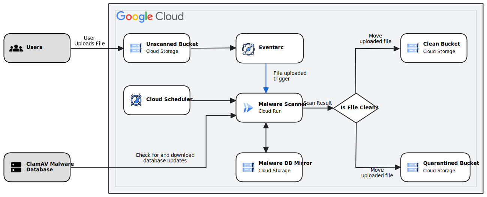

# Malware Scanner Service

This repository contains the code to build a pipeline that scans objects
uploaded to GCS for malware, moving the documents to a clean or quarantined
bucket depending on the malware scan status.

It illustrates how to use Cloud Run and Eventarc to build such a pipeline.



## How to use this example

Use the
[tutorial](https://cloud.google.com/solutions/automating-malware-scanning-for-documents-uploaded-to-cloud-storage)
to understand how to configure your Google Cloud Platform project to use Cloud
Run and Eventarc.

## Changes

* 2019-09-01 Initial version
* 2020-10-05 Fixes for ClamAV OOM
* 2021-10-14 Use Cloud Run and EventArc instead of Cloud Functions/App Engine
* 2021-10-22 Improve resiliency, Use streaming reads (no temp disk required),
    improve logging, and handles files in subdirectories
* 2021-11-08 v1.2.0 Add support for scanning multiple buckets, improve error
    handling to prevent infinite retries
* 2021-11-22 v1.3.0 Remove requirement for Project Viewer permissions.
* 2022-02-22 v1.5.0 Fix node-forge vulnerability.
* 2022-03-01 v1.6.0 Support larger file sizes (up to 500MiB) (#24)
* 2022-06-07 v1.7.0 Fix issue #32 where clamav cannot update itself on container start
* 2022-11-25 v2.0.0 Resolve #35 where ClamAV update servers blacklist cloud run IPs.
    adds a local cache of ClamAV definition files which is updated on a schedule.
* 2023-06-20 v2.1.0 Resolve #46 where docker build failed, and #50 where pip3
    installs failed
* 2023-11-22 v2.2.0 Add support for using environmental variables in the config.json file.
* 2023-11-27 v2.3.0 Remove need for cloud-run-proxy, and update versions of packages. Fixes multiple CVEs.
* 2023-11-28 v2.3.1 Fix user agent string to use correct format.

## Upgrading from v1.x to v2.x

Version 2 has a different way of handling ClamAV updates to avoid issues with the ClamAV content distribution network.

### Background

ClamAV requires an up to date virus definition database to function, but Cloud Run containers are stateless. Therefore in V1.x, on container startup, the freshclam daemon downloads the entire virus definition database from ClamAV's CDN.

ClamAV updated their CDN to rate limit the downloads by IP address to prevent excessive use, and as Cloud Run uses a common IP address pool for all egress connections, v1.x frequently triggered this rate limiting, which then prevented the download and update of the ClamAV database definitions, and  prevented container startup.

V2.x resolves this issue by maintaining a mirror of the malware database definitions in Cloud Storage, which is regularly updated using [cvdupdate](https://github.com/Cisco-Talos/cvdupdate) to download only the difference files. ClamAV's update service, freshclam, then only downloads from this mirror avoiding issues with the ClamAV CDN

### Differences between v1.x and v2.x

v2.x uses the `config.json` file for passing the bucket configuration - previously this was only required if multiple unscanned buckets are configured

v2.x requires the following additional services

* An additional Cloud Storage bucket for the ClamAV database mirror
* A Cloud Scheduler job to trigger updating of the Cloud Storage mirror. This causes the container to run the [updateCvdMirror.sh](cloudrun-malware-scanner/updateCvdMirror.sh).

### Upgrade instructions

Assuming that you already have a v1.7.0 service installed, perform the following steps in Cloud Shell to update it to v2.0:

1.  Enable the [Cloud Scheduler API](https://console.cloud.google.com/flows/enableapi?apiid=cloudscheduler.googleapis.com) on your project.

1.  Clone, or fetch and checkout the the head of the github repository to get the 2.0 source files

1.  Change to the `cloudrun-malware-scanner` directory:

    ```shell
    cd docker-clamav-malware-scanner/cloudrun-malware-scanner
    ```

1.  Set up the following shell variables for your project, replacing `MY_PROJECT_ID` with your project ID, and configure gcloud.

    ```shell
    REGION=us-central1
    LOCATION=us
    PROJECT_ID=MY_PROJECT_ID
    SERVICE_NAME=malware-scanner
    SERVICE_ACCOUNT="${SERVICE_NAME}@${PROJECT_ID}.iam.gserviceaccount.com"
    gcloud config set project "${PROJECT_ID}"
    ```

1.  Create a Cloud Storage bucket for your ClamAV database mirror, and grant the service account access to this bucket

    ```shell
    gsutil mb -l "${LOCATION}" "gs://cvd-mirror-${PROJECT_ID}"
    gsutil iam ch \
        "serviceAccount:${SERVICE_ACCOUNT}:objectAdmin" \
        "gs://cvd-mirror-${PROJECT_ID}"
    ```

1.  If you do not have a `config.json` file, create one from the template, edit it and confirm the names of your buckets:

    ```shell
    sed "s/-bucket-name/-${PROJECT_ID}/" config.json.tmpl > config.json
    nano config.json
    ```

1.  Perform an initial population of the ClamAV malware database mirror in
    cloud storage:
    
    ```shell
    python3 -m venv pyenv
    . pyenv/bin/activate
    pip3 install crcmod cvdupdate
    ./updateCvdMirror.sh "cvd-mirror-${PROJECT_ID}"
    deactivate
    ```

    You can check the contents of the mirror with the command: 

    ```shell
    gsutil ls "gs://cvd-mirror-${PROJECT_ID}/cvds"
    ```

    It should contain several `.cvd` files, containing the full malware database, several `.cdiff` files containing the daily differential updates, and some `.json` files with configuration and state information.

1.  Build and deploy the updated service:

    ```shell
    export SERVICE_NAME=malware-scanner
    gcloud beta run deploy "${SERVICE_NAME}" \
      --source . \
      --region "${REGION}" \
      --no-allow-unauthenticated \
      --memory 4Gi \
      --cpu 1 \
      --concurrency 20 \
      --min-instances 1 \
      --max-instances 5 \
      --no-cpu-throttling \
      --cpu-boost \
      --service-account="${SERVICE_ACCOUNT}" 
    ```

    The build and deployment takes about 10 minutes. Once complete, you will see a message:

    ```
    Service [malware-scanner] revision [malware-scanner-NNNNN-XXX] has been deployed and is serving 100 percent of traffic.
    Service URL: https://malware-scanner-XXXXXXXX-XX.a.run.app
    ```

    Store the `Service URL` value from the output of the deployment command in a shell variable. 

    ```
    SERVICE_URL="https://malware-scanner-XXXXXXXX-XX.a.run.app"
    ```

1.  Create a Cloud Scheduler job that executes an HTTP POST request on the Cloud Run service with
    a command to update the mirror of the malware definitions database.
    To avoid having too many clients use the same time slot, 
    [ClamAV](https://docs.clamav.net/manual/Usage/Configuration.html#freshclamconf)
    requires that you schedule the job at a random minute between 3 and 57, avoiding multiples of 10.

    ```shell
    while : ; do
      # set MINUTE to a random number between 3 and 57
      MINUTE="$((RANDOM%55 + 3))"
      # exit loop if MINUTE is not a multiple of 10
      [[ $((MINUTE % 10)) != 0 ]] && break
    done

    gcloud scheduler jobs create http \
        "${SERVICE_NAME}-mirror-update" \
        --location="${REGION}" \
        --schedule="${MINUTE} */2 * * *" \
        --oidc-service-account-email="${SERVICE_ACCOUNT}" \
        --uri="${SERVICE_URL}" \
        --http-method=post \
        --message-body='{"kind":"schedule#cvd_update"}' \
        --headers="Content-Type=application/json"
    ```

    The `--schedule` command line argument defines when the job will run
    [using the unix-cron string format](/scheduler/docs/configuring/cron-job-schedules){: track-type="solution" track-name="internalLink" track-metadata-position="body" }.
    The value given indicates that it should run at the specific randomly-generated
    minute every 2 hours.

    This job will only update the ClamAV *mirror* in Cloud Storage. The
    [ClamAV freshclam daemon](https://docs.clamav.net/manual/Usage/SignatureManagement.html#freshclam){: target="external" track-type="solution" track-name="externalLink" track-metadata-position="body" }
    in each instance of the Cloud Run job will check the mirror every
    thirty minutes for new definitions, and update the ClamAV daemon.
    You can force this job to run at any time using the command:

    ```shell
    gcloud scheduler jobs run malware-scanner-update --location="${REGION}"
    ```

    The results of this command will only be shown in the detailed logs.

### Viewing detailed logs

1. In the Cloud Console, go to the [Logs Explorer](https://console.cloud.google.com/logs/query)
   page.

1. If the **Log fields** filter is not displayed, click the **Log Fields**
   button.

1. In the **Log Fields** filter, click **Cloud Run Revision**

1. In the **Service Name** section of the **Log Fields** filter, click
   **malware-scanner**


You can see the malware definitions mirror update checks from the following log lines: 

```
Starting CVD Mirror update
CVD Mirror update check complete. output: ...
```

If the mirror was updated, there will be an additional line: 

```
CVD Mirror updated: DATETIME daily.cld updated (version: MMMMM ...
```

Freshclam daemon update logs will appear every 30 mins and will show as: 

```
Received signal: wake up
ClamAV update process started at Mon Nov 14 14:29:51 2022
daily.cvd database is up-to-date (version: NNNNN ... 
main.cvd database is up-to-date (version: NNNNN ...
bytecode.cvd database is up-to-date (version: NNNNN ...
```

If the database was updated, the log lines will instead show as: 

```
DATETIME -> daily.cld updated (version: MMMMM ...
```

## License

Copyright 2022 Google LLC

Licensed under the Apache License, Version 2.0 (the "License"); you may not use
this file except in compliance with the License. You may obtain a copy of the
License at

```
https://www.apache.org/licenses/LICENSE-2.0
```

Unless required by applicable law or agreed to in writing, software distributed
under the License is distributed on an "AS IS" BASIS, WITHOUT WARRANTIES OR
CONDITIONS OF ANY KIND, either express or implied. See the License for the
specific language governing permissions and limitations under the License.
